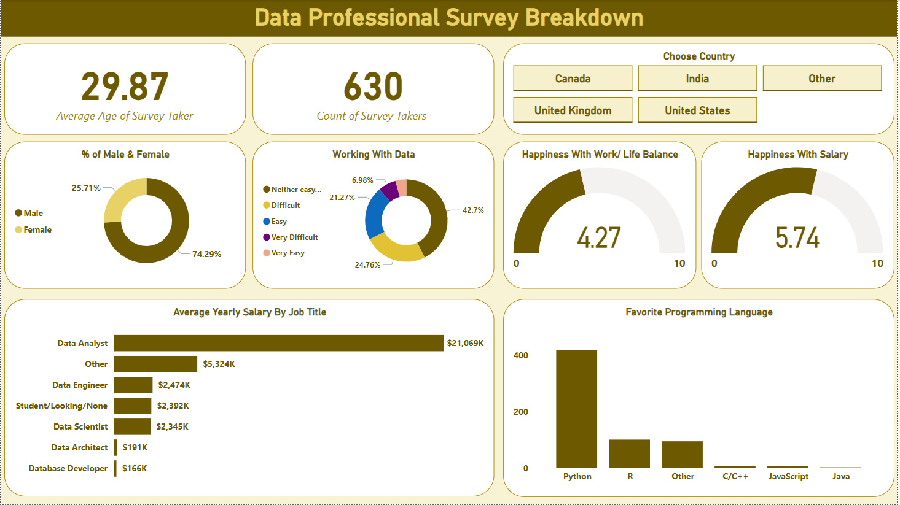

# Data Professional Survey Breakdown

## Dashboard Preview

## Problem
Understanding the demographics, work environment, salaries, and preferences of data professionals across different countries.  
The goal is to answer:  
- Who are the people working in data roles?  
- How satisfied are they with salary and work-life balance?  
- What are the average salaries by job title?  
- Which programming languages are most preferred?

## D → Data
- Source: Survey data from 630 participants in multiple countries.  
- Data includes: age, gender, country, job title, salary, happiness scores, and preferred programming language.  
- Format: Excel dataset imported into Power BI.  

## Tools
- **Power BI** for visualization and dashboard creation.  
- **Excel** as the raw data source.  
- GitHub for version control and project sharing.  

## Preparation
- Cleaned and formatted the survey dataset.  
- Handled missing values and standardized job titles.  
- Created measures and calculated fields in DAX (e.g., average salary, happiness index).  
- Built relationships between tables for accurate analysis.  

## Analysis
- Average survey taker age: **29.87 years**.  
- Gender split: **74% Male, 26% Female**.  
- Working with data: majority rated experience as **Easy (42.7%)**.  
- Salary analysis: Data Analysts reported the highest yearly salary.  
- Programming language: **Python** is the most popular.  
- Average happiness with salary: **5.74/10**; work-life balance: **4.27/10**.  

## Recommendations
- Organizations should focus on improving **salary satisfaction** and **work-life balance**.  
- Data professionals aiming for higher salaries may benefit from pursuing roles like **Data Analyst**.  
- Python remains the most in-demand programming language and is a good choice for aspiring professionals.  
