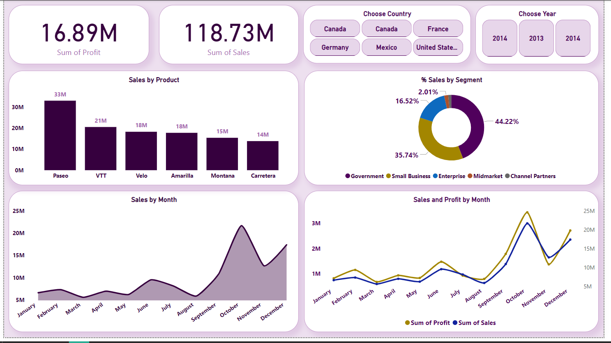

# Sales_and_Profit_Analysis

## Dashboard Preview

## Problem

The company needs a comprehensive analysis of sales and profit across products, countries, and customer segments to support data-driven decision making.

## Data

- **Source**: Sales dataset (Excel/CSV).
- **Content**: Thousands of records covering _Products, Sales, Profit, Country, Segment, Year_.

## Tools

- **Power BI Desktop** → for visualization and analysis.
- **Excel** → for initial data cleaning and preparation.

## Preparation

- Cleaned missing/incorrect values.
- Converted columns into proper data types (dates, numeric values).
- Created DAX measures to calculate **Sum of Profit** and **Sum of Sales**.

## Analysis

- **Sales by Product** → Top-selling product is _Paseo_ with **33M sales**.
- **% Sales by Segment** → _Government_ segment leads with **44%**.
- **Sales by Month** → October has the highest sales (~**22M**).
- **Sales vs Profit by Month** → Sales and profit trends move in parallel.

## Results

- **Total Sales**: 118.73M
- **Total Profit**: 16.89M
- October recorded the peak sales, and _Paseo_ is the top contributor.

## Recommendations

- Focus on _Paseo_ and explore similar product categories.
- Increase marketing and sales efforts toward the _Government_ segment.
- Work on boosting sales in weaker months (e.g., August).
